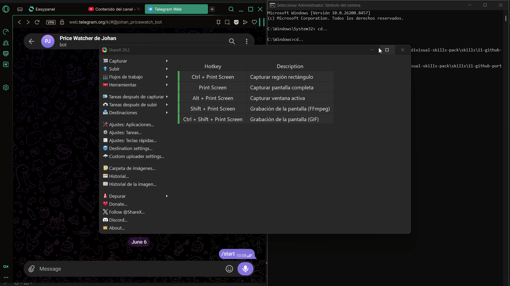

# 🤖 Daily Brief

> Cada mañana recoge tus fuentes RSS favoritas, las resume con IA (OpenAI o Claude) y te manda un digest limpio a Telegram. Python para la lógica, n8n para la automatización.


## ¿Qué hace?

Leer 10 fuentes cada mañana cansa; un resumen de 30 segundos no. **Daily Brief** consulta los feeds RSS que tú elijas, manda los titulares a una API de IA (OpenAI o Claude, tú decides) para que los resuma en un digest escaneable, y te lo entrega por Telegram a la hora que quieras.

Combina **dos cosas que se venden muy bien juntas**: automatización programada (n8n) e IA aplicada (resumen con OpenAI o Claude, elegible con una variable de entorno). Funciona de dos formas con el mismo código:

- **Como script** programado con cron (Python genera y envía el digest).
- **Como workflow de n8n**, donde Python genera el digest y n8n lo entrega.

## Demo

<!-- Añade tu GIF: `python src/main.py --demo` + el digest llegando a Telegram. Ver docs/DEMO.md -->


## Tecnologías

| Capa | Herramienta |
|---|---|
| Lógica | Python (`feedparser`, `requests`) |
| IA | OpenAI (`openai`) o Claude (`anthropic`), elegible con `LLM_PROVIDER` |
| Configuración | JSON + variables de entorno (`python-dotenv`) |
| Entrega | API de Telegram Bot |
| Orquestación | n8n (Schedule Trigger) o cron |

## Instalación

```bash
git clone https://github.com/<tu-usuario>/daily-brief.git
cd daily-brief
pip install -r requirements.txt

cp config.example.json config.json   # pon tus feeds RSS
cp .env.example .env                  # pon tu API key (OpenAI o Claude) y tu bot de Telegram
```

> En Windows usa `copy` en lugar de `cp`.

## Uso

```bash
# Genera el resumen real y lo envía a Telegram
python src/main.py

# Imprime el digest en JSON (para n8n) sin enviar nada
python src/main.py --json

# Prueba con datos y resumen simulados, sin red ni API key
python src/main.py --demo
```

### Configurar las fuentes (`config.json`)

```json
{
  "feeds": [
    "https://hnrss.org/frontpage",
    "https://www.xataka.com/index.xml"
  ],
  "max_items_per_feed": 5
}
```

### Variables de entorno (`.env`)

| Variable | Para qué |
|---|---|
| `LLM_PROVIDER` | `openai` (por defecto) o `anthropic`. Elige qué IA resume |
| `OPENAI_API_KEY` | Acceso a la API de OpenAI (si usas ese proveedor) |
| `OPENAI_MODEL` | (Opcional) modelo OpenAI; por defecto `gpt-4o-mini` |
| `ANTHROPIC_API_KEY` | Acceso a la API de Claude (si usas ese proveedor) |
| `ANTHROPIC_MODEL` | (Opcional) modelo Claude; por defecto `claude-haiku-4-5` |
| `TELEGRAM_BOT_TOKEN` | Bot que envía el digest |
| `TELEGRAM_CHAT_ID` | Chat donde lo recibes |

## Automatizar con n8n

1. Importa `workflow.json` (`Workflows → Import from File`).
2. Conecta tu credencial de Telegram en el nodo *Enviar a Telegram*.
3. Ajusta la ruta del script en el nodo *Generar digest*.
4. Activa: cada día a las 8:00 recibes tu resumen.

```
Schedule (cron 0 8 * * *) → Ejecutar script (--json) → Parsear → Telegram
```

Detalle en [`docs/arquitectura.md`](docs/arquitectura.md).

## Roadmap

- [x] Resumen de feeds RSS con IA
- [x] Soporte multi-proveedor de IA (OpenAI o Claude) elegible por configuración
- [x] Lectura de feeds robusta con reintentos ante fallos transitorios
- [x] Entrega por Telegram
- [x] Modo `--json` para n8n y modo `--demo` sin dependencias
- [ ] Filtrado por palabras clave / temas de interés
- [ ] Entrega también por email
- [ ] Deduplicar noticias repetidas entre feeds

## Licencia

MIT
